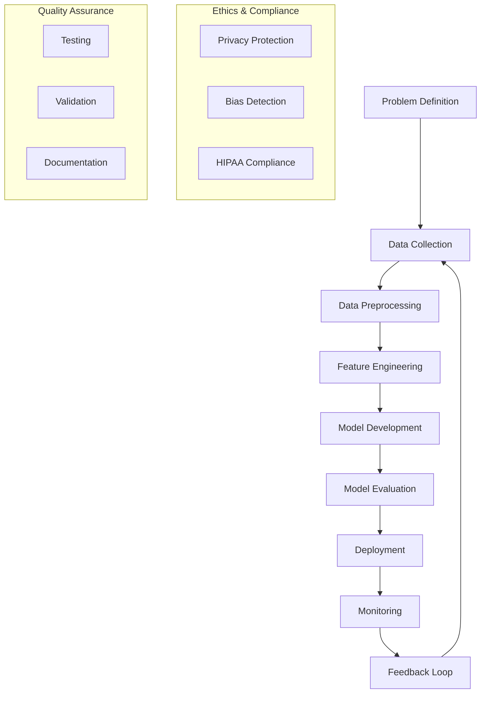

# AI Development Workflow Assignment Response

## Part 1: Short Answer Questions (30 points)

### 1. Problem Definition (6 points)

**AI Problem**: Automated Code Review Assistant

**Objectives**:
1. Reduce code review time by 50% through automated initial screening
2. Improve code quality by identifying potential bugs and security vulnerabilities
3. Standardize coding practices across development teams

**Stakeholders**:
1. Development Teams (primary users)
2. Project Managers (tracking code quality metrics)

**Key Performance Indicator (KPI)**:
- Reduction in post-deployment bugs (measured by comparing bug reports before and after system implementation)

### 2. Data Collection & Preprocessing (8 points)

**Data Sources**:
1. Open-source code repositories (GitHub, GitLab) with associated code review comments
2. Internal code review history and bug tracking systems

**Potential Bias**:
- Over-representation of certain programming languages (e.g., JavaScript, Python) in training data could lead to reduced performance on less common languages

**Preprocessing Steps**:
1. Code tokenization and normalization (removing comments, standardizing whitespace)
2. Feature extraction (AST generation, complexity metrics)
3. Balancing dataset across programming languages and project types

### 3. Model Development (8 points)

**Model Choice**: Transformer-based architecture (specifically CodeBERT)

**Justification**:
- Pre-trained on large code corpus
- Handles variable-length input effectively
- Strong performance in code understanding tasks
- Built-in attention mechanism for context awareness

**Data Splitting**:
- Training set: 70% (chronologically older code reviews)
- Validation set: 15% (more recent code reviews)
- Test set: 15% (most recent code reviews)
- This temporal split helps detect concept drift

**Hyperparameters to Tune**:
1. Learning rate: Critical for model convergence and avoiding local minima
2. Attention dropout rate: Important for preventing overfitting on specific code patterns

### 4. Evaluation & Deployment (8 points)

**Evaluation Metrics**:
1. Precision: Important because false positives (incorrect suggestions) waste developer time
2. Recall: Critical for not missing serious code issues

**Concept Drift**:
- Definition: Changes in the relationship between input features and target variables over time
- Monitoring: Track model performance metrics weekly, comparing against baseline
- Implementation: Use sliding window evaluation on recent code reviews

**Technical Challenge**:
- Scalability: Processing large codebases in real-time
- Solution: Implement distributed processing and caching mechanisms

## Part 2: Case Study Application (40 points)

### Problem Scope (5 points)

**Problem Definition**: Predict patient readmission risk within 30 days of discharge

**Objectives**:
1. Reduce readmission rates through early intervention
2. Optimize resource allocation
3. Improve patient outcomes

**Stakeholders**:
1. Patients and families
2. Healthcare providers
3. Hospital administration
4. Insurance providers

### Data Strategy (10 points)

**Data Sources**:
1. Electronic Health Records (EHRs)
   - Medical history
   - Medications
   - Lab results
   - Vital signs
2. Demographics data
3. Social determinants of health
4. Previous admission records

**Ethical Concerns**:
1. Patient Privacy
   - Implementation: HIPAA-compliant data handling
   - Data anonymization
   - Secure storage and transmission
2. Demographic Bias
   - Risk of perpetuating existing healthcare disparities
   - Need for representative training data

**Preprocessing Pipeline**:
1. Data Collection
   - Secure API integration with EHR systems
   - Regular data updates
2. Cleaning
   - Handle missing values using domain-appropriate methods
   - Remove duplicates
   - Standardize units
3. Feature Engineering
   - Create temporal features (e.g., time since last admission)
   - Aggregate lab results
   - Generate comorbidity scores
4. Normalization
   - Scale numerical features
   - Encode categorical variables
5. Validation
   - Data quality checks
   - Cross-reference with medical knowledge

### Model Development (10 points)

**Model Selection**: Gradient Boosting Decision Tree (XGBoost)

**Justification**:
- Handles mixed data types well
- Interpretable predictions
- Good performance with imbalanced data
- Built-in feature importance
- Efficient training and inference

**Confusion Matrix (Hypothetical)**:
```
                 Predicted No    Predicted Yes
Actual No         800 (TN)       100 (FP)
Actual Yes        150 (FN)       450 (TP)
```

**Metrics**:
- Precision = 450/(450+100) = 0.82
- Recall = 450/(450+150) = 0.75

### Deployment (10 points)

**Integration Steps**:
1. Model Packaging
   - Containerization
   - Version control
   - Documentation
2. API Development
   - RESTful endpoints
   - Input validation
   - Error handling
3. Testing
   - Unit tests
   - Integration tests
   - Load testing
4. Monitoring Setup
   - Performance metrics
   - Error logging
   - Usage statistics
5. Rollout
   - Phased deployment
   - A/B testing
   - Feedback collection

**HIPAA Compliance**:
1. Data Security
   - Encryption at rest and in transit
   - Access control
   - Audit logging
2. Privacy Measures
   - Data minimization
   - Purpose specification
   - Patient consent management
3. Documentation
   - Policy documentation
   - Training materials
   - Compliance audits

### Optimization (5 points)

**Addressing Overfitting**:
- Implementation of regularization techniques
- Cross-validation with multiple folds
- Feature selection based on clinical relevance
- Regular model retraining with updated data
- Ensemble methods with bagging

## Part 3: Critical Thinking (20 points)

### Ethics & Bias (10 points)

**Impact of Biased Training Data**:
- Underrepresentation of minority groups could lead to less accurate predictions
- Socioeconomic factors might not be properly accounted for
- Historical healthcare access disparities could be perpetuated

**Mitigation Strategy**:
- Implement fairness constraints in model training
- Regular bias audits across demographic groups
- Collect additional data from underrepresented populations
- Collaborate with domain experts to validate model decisions

### Trade-offs (10 points)

**Interpretability vs. Accuracy**:
- Healthcare requires explainable decisions
- Complex models might achieve higher accuracy but be less interpretable
- Solution: Use interpretable models (e.g., GBDT) with SHAP values
- Maintain balance between performance and explainability

**Resource Constraints**:
- Impact on model choice:
  - Prefer lighter models (e.g., Random Forest over Deep Learning)
  - Implement batch processing
  - Use feature selection to reduce dimensionality
  - Consider cloud computing for training only

## Part 4: Reflection & Workflow Diagram (10 points)

### Reflection (5 points)

**Most Challenging Part**:
- Balancing ethical considerations with model performance
- Ensuring HIPAA compliance while maintaining system usability
- Managing stakeholder expectations regarding model capabilities

**Potential Improvements**:
- Implement automated bias detection
- Develop more sophisticated feature engineering
- Create better visualization tools for model interpretability
- Establish stronger feedback loops with healthcare providers

### Workflow Diagram (5 points)

